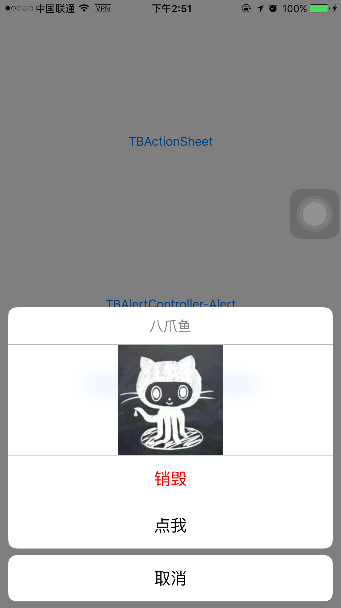

# TBActionSheet

TBActionSheet is a custom action sheet. The default style is iOS9, you can make your own style.  

This is the iOS9 style of `TBActionSheet` running on iOS7&iPhone 4s:


You can also add your custom `UIView` under the title of `TBActionSheet`:



This repo also include `TBAlertController`, which unifies `UIAlertController`, `UIAlertView`, and `UIActionSheet`. For more infomation about `TBAlertController`, please visit [this post](http://yulingtianxia.com/blog/2015/11/13/Summary-of-the-first-month-in-the-internship-of-Tencent/) of my blog.

##Cocoapods

Please search TBActionSheet

##Usage

The base usage is same to `UIActionSheet`. You can just replace `UIActionSheet` with `TBActionSheet`. If you want to customize your action sheet, just configure some properties. I believe the header file can tell you much more than me. 

```
@interface TBActionSheet : UIView
@property(nullable,nonatomic,weak) id<TBActionSheetDelegate> delegate;
@property(nonatomic,copy)  NSString * _Nullable  title;

- (nonnull instancetype)initWithTitle:(nullable NSString *)title delegate:(nullable id <TBActionSheetDelegate>)delegate cancelButtonTitle:(nullable NSString *)cancelButtonTitle destructiveButtonTitle:(nullable NSString *)destructiveButtonTitle otherButtonTitles:(nullable NSString *)otherButtonTitles, ... NS_REQUIRES_NIL_TERMINATION;
- (nonnull instancetype)initWithFrame:(CGRect)frame NS_UNAVAILABLE;

// adds a button with the title. returns the index (0 based) of where it was added. buttons are displayed in the order added except for the
// destructive and cancel button which will be positioned based on HI requirements. buttons cannot be customized.
- (NSInteger)addButtonWithTitle:(nullable NSString *)title;
- (NSInteger)addButtonWithTitle:(nullable NSString *)title style:(TBActionButtonStyle)style;    // returns index of button. 0 based.
- (nullable NSString *)buttonTitleAtIndex:(NSInteger)buttonIndex;
@property(nonatomic,readonly) NSInteger numberOfButtons;
@property(nonatomic) NSInteger cancelButtonIndex;      // if the delegate does not implement -actionSheetCancel:, we pretend this button was clicked on. default is -1
@property(nonatomic) NSInteger destructiveButtonIndex; // sets destructive (red) button. -1 means none set. default is -1. ignored if only one button

@property(nonatomic,readonly) NSInteger firstOtherButtonIndex;	// -1 if no otherButtonTitles or initWithTitle:... not used
@property(nonatomic,readonly,getter=isVisible) BOOL visible;

- (void)showInView:(nonnull UIView *)view;

//custom UI
/**
 *  按钮高度
 */
@property(nonatomic) CGFloat buttonHeight;
/**
 *  标题高度
 */
@property(nonatomic) CGFloat titleHeight;
/**
 *  actionsheet下方的 y 轴位移，向下为正，默认值为 -8
 */
@property(nonatomic) CGFloat bottomOffset;
/**
 *  标题 UILabel
 */
@property(nonatomic,strong,nullable,readonly) UILabel *titleLabel;
/**
 *  文字颜色
 */
@property(nonatomic,strong,nonnull) UIColor *tintColor;
@property(nonatomic,strong,nonnull) UIColor *destructiveButtonColor;
@property(nonatomic,strong,nonnull) UIColor *cancelButtonColor;
/**
 *  按钮字体
 */
@property(nonatomic,strong,nonnull) UIFont *buttonFont;
/**
 *  sheet 的宽度，也就是按钮宽度
 */
@property(nonatomic) CGFloat sheetWidth;
/**
 *  是否让背景透明
 */
@property(nonatomic, getter=isBackgroundTransparentEnabled) BOOL backgroundTransparentEnabled;
/**
 *  是否启用毛玻璃效果
 */
@property(nonatomic, getter=isBlurEffectEnabled) BOOL blurEffectEnabled;
/**
 *  是否使用圆角矩形
 */
@property(nonatomic, getter=isRectCornerEnabled) BOOL rectCornerEnabled;
/**
 *  ActionSheet 的背景色，如果 useBlurEffect 为 YES，会与其效果混合。
 */
@property(nonatomic,strong,nonnull) UIColor *backgroundColor;
/**
 *  自定义视图
 */
@property(nonatomic,strong,nullable) UIView *customView;

@end

@protocol TBActionSheetDelegate <NSObject>
@optional

// Called when a button is clicked. The view will be automatically dismissed after this call returns
- (void)actionSheet:(nonnull TBActionSheet *)actionSheet clickedButtonAtIndex:(NSInteger)buttonIndex;
// Called when we cancel a view (eg. the user clicks the Home button). This is not called when the user clicks the cancel button.
// If not defined in the delegate, we simulate a click in the cancel button
- (void)actionSheetCancel:(nonnull TBActionSheet *)actionSheet;

- (void)willPresentActionSheet:(nonnull TBActionSheet *)actionSheet;  // before animation and showing view
- (void)didPresentActionSheet:(nonnull TBActionSheet *)actionSheet;  // after animation

- (void)actionSheet:(nonnull TBActionSheet *)actionSheet willDismissWithButtonIndex:(NSInteger)buttonIndex; // before animation and hiding view
- (void)actionSheet:(nonnull TBActionSheet *)actionSheet didDismissWithButtonIndex:(NSInteger)buttonIndex;  // after animation

@end
```

There is also an example project for `TBActionSheet` and `TBAlertController`.

## License

The MIT License.