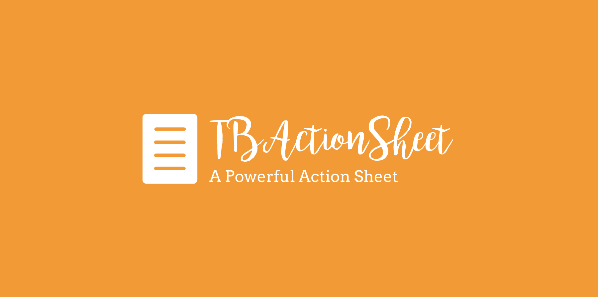

<p align="center">
<a href="https://github.com/yulingtianxia/TBActionSheet">

</a>
</p>

[](https://travis-ci.org/yulingtianxia/TBActionSheet)
[](http://cocoapods.org/pods/TBActionSheet)
[](https://github.com/Carthage/Carthage)
[](http://cocoapods.org/pods/TBActionSheet)
[](http://cocoapods.org/pods/TBActionSheet)
[](http://cocoapods.org/pods/TBActionSheet)
[](http://cocoapods.org/pods/TBActionSheet)
[](https://twitter.com/yulingtianxia)

# TBActionSheet

TBActionSheet is a small library that allows you to substitute Apple's uncustomizable `UIActionSheet`, with a beautiful and totally customizable actionsheet that you can use in your iOS app. The default style is iOS9/10, you can make your own style. Enjoy!  

Here are some pictures showing TBActionSheet's powerful individuation. You can change UI dynamically:


BTW, `TBActionSheet` also supports **CUSTOM ANIMATION**!

## 🌟 Feature

- [x] Title
- [x] Description message
- [x] Insert a custom view at anywhere
- [x] Custom animation.
- [x] Customizations: fonts, colors, dimensions, corners & more
- [x] Closure when a button or background is pressed
- [x] Similar implementation to UIActionSheet
- [x] Add button using block syntax
- [x] Scroll the whole action sheet.
- [x] Blur Effect under iOS7
- [x] Autorotation under iOS8
- [x] CocoaPods
- [x] Carthage

## 📚 Article

- [自制一款强大的 ActionSheet](http://yulingtianxia.com/blog/2016/07/18/TBActionSheet/)
- [腾讯实习第一个月工作总结](http://yulingtianxia.com/blog/2015/11/13/Summary-of-the-first-month-in-the-internship-of-Tencent/)

## 🔮 Example

To run the example project, clone the repo and run MTDemo target.

## 💰 Requirement

- iOS 7.0+ (iOS 8.0+ full features supported)
- Xcode 10.1+

## 📲 Installation

### CocoaPods

[CocoaPods](http://cocoapods.org) is a dependency manager for Cocoa projects. You can install it with the following command:

```bash
$ gem install cocoapods
```

To integrate TBActionSheet into your Xcode project using CocoaPods, specify it in your `Podfile`:


```
source 'https://github.com/CocoaPods/Specs.git'
platform :ios, '9.0'
use_frameworks!
target 'MyApp' do
	pod 'TBActionSheet'
end
```

You need replace "MyApp" with your project's name.

Then, run the following command:

```bash
$ pod install
```

### Carthage

[Carthage](https://github.com/Carthage/Carthage) is a decentralized dependency manager that builds your dependencies and provides you with binary frameworks.

You can install Carthage with [Homebrew](http://brew.sh/) using the following command:

```bash
$ brew update
$ brew install carthage
```

To integrate TBActionSheet into your Xcode project using Carthage, specify it in your `Cartfile`:

```ogdl
github "yulingtianxia/TBActionSheet"
```

Run `carthage update` to build the framework and drag the built `TBActionSheetKit.framework` into your Xcode project.

### Manual

Just drag the "Source" document folder into your project.

## 🐒 Usage

### TLDR

You can refer to 'ViewController.m' in the TBAlertControllerDemo project.The base usage is same as 'UIActionSheet'.

To let TBActionSheet looks like WeChat style, you can set these properties of `TBActionShet` or it's `UIAppearance` like this :

```
sheetWidth = MIN(kScreenWidth, kScreenHeight);
backgroundTransparentEnabled = NO;
rectCornerRadius = 0;
``` 

### More than what you want

The base usage is same to `UIActionSheet`. You can just replace `UIActionSheet` with `TBActionSheet`. If you want to customize your action sheet, just configure some properties. 

[GitHub wiki](https://github.com/yulingtianxia/TBActionSheet/wiki) can help you master advanced usage.

There is also an example project for `TBActionSheet`.

## TBAlertController

This repo also include `TBAlertController`, which unifies `UIAlertController`, `UIAlertView`, and `UIActionSheet`. `TBAlertController` will use `UIAlertController` on iOS 8.2 and later. On the contrary, it will use `UIAlertView` or `UIActionSheet`.

The API Usage of `TBAlertController` is similar to `UIAlertController`. I also provide `TBAlertAction` instead of `UIAlertAction`.

There is an example:

```
TBAlertController *controller = [TBAlertController alertControllerWithTitle:@"TBAlertController" message:@"AlertStyle" preferredStyle:TBAlertControllerStyleAlert];
TBAlertAction *clickme = [TBAlertAction actionWithTitle:@"点我" style: TBAlertActionStyleDefault handler:^(TBAlertAction * _Nonnull action) {
    NSLog(@"%@",action.title);
}];
TBAlertAction *cancel = [TBAlertAction actionWithTitle:@"取消" style: TBAlertActionStyleCancel handler:^(TBAlertAction * _Nonnull action) {
    NSLog(@"%@",action.title);
}];
[controller addAction:clickme];
[controller addAction:cancel];
[self presentViewController:controller animated:YES completion:nil];
```

For more infomation about `TBAlertController`, please visit [this post](http://yulingtianxia.com/blog/2015/11/13/Summary-of-the-first-month-in-the-internship-of-Tencent/) of my blog.

## ❤️ Contributed

- If you **need help** or you'd like to **ask a general question**, open an issue.
- If you **found a bug**, open an issue.
- If you **have a feature request**, open an issue.
- If you **want to contribute**, submit a pull request.

## 👨🏻‍💻 Author

yulingtianxia, yulingtianxia@gmail.com

## 👮🏻 License

TBActionSheet is available under the MIT license. See the LICENSE file for more info.

