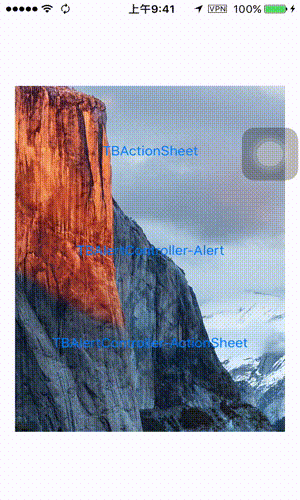
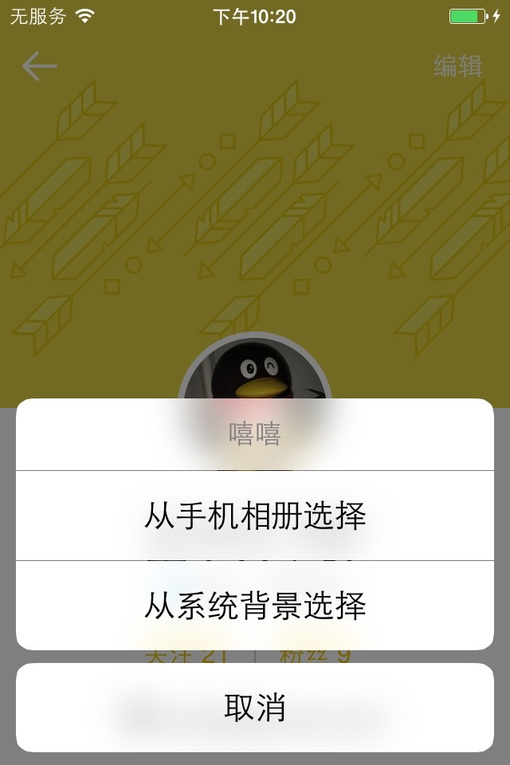
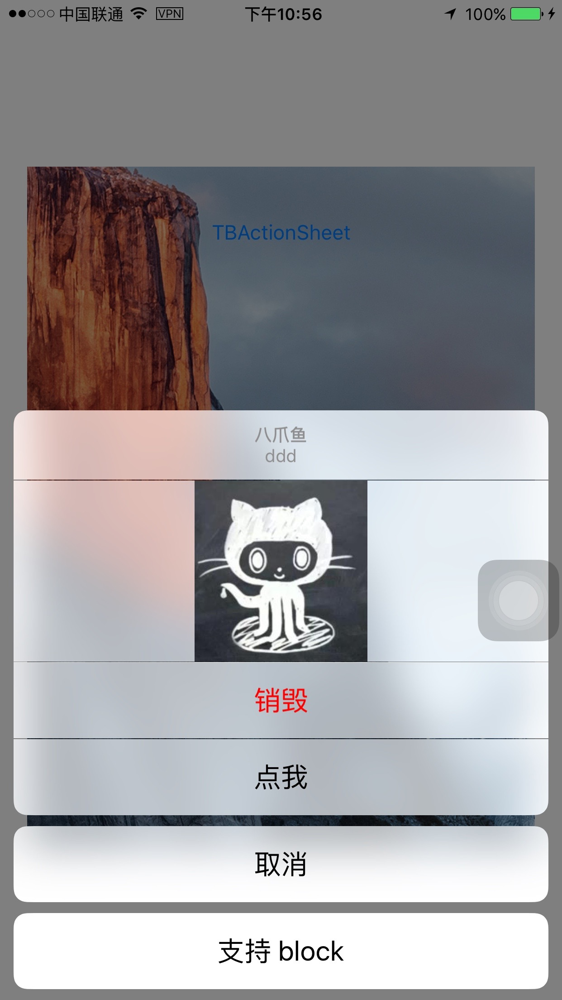

# TBActionSheet

[](https://travis-ci.org/yulingtianxia/TBActionSheet)
[](http://cocoapods.org/pods/TBActionSheet)
[](https://github.com/Carthage/Carthage)
[](http://cocoapods.org/pods/TBActionSheet)
[](http://cocoapods.org/pods/TBActionSheet)


TBActionSheet is a small library that allows you to substitute Apple's uncustomizable `UIActionSheet`, with a beautiful and totally customizable actionsheet that you can use in your iOS app. The default style is iOS9/10, you can make your own style. Enjoy!  

Here is a gif showing TBActionSheet's powerful individuation:


You can add buttons on it dynamically:



This is the iOS9/10 style of `TBActionSheet` running on iOS7&iPhone 4s:



You can also add your custom `UIView` under the title of `TBActionSheet`:



**TBActionSheet supports autorotation**, but there is some bugs on iOS7 :(

BTW, `TBActionSheet` also suppots BLOCK now!

## Features

- [x] Title
- [x] Description message
- [x] Custom Header View (Optional)
- [x] Customizations: fonts, colors, dimensions, corners & more
- [x] Closure when a button or background is pressed
- [x] Similar implementation to UIActionSheet
- [x] Add button using block syntax
- [x] Scroll the whole action sheet.
- [x] Blur Effect under iOS7
- [x] Autorotation under iOS8
- [x] Cocoapods
- [x] Carthage

## Articles

[自制一款强大的 ActionSheet](http://yulingtianxia.com/blog/2016/07/18/TBActionSheet/)

## Requirements

- iOS 6.0+ (iOS 8.0+ full features supported)
- Xcode 7.3+

## Installation
### CocoaPods

[CocoaPods](http://cocoapods.org) is a dependency manager for Cocoa projects. You can install it with the following command:

```bash
$ gem install cocoapods
```

To integrate TBActionSheet into your Xcode project using CocoaPods, specify it in your `Podfile`:


```
source 'https://github.com/CocoaPods/Specs.git'
platform :ios, '9.0'
use_frameworks!
target 'MyApp' do
	pod 'TBActionSheet'
end
```

You need replace "MyApp" with your project's name.

Then, run the following command:

```bash
$ pod install
```

### Carthage

[Carthage](https://github.com/Carthage/Carthage) is a decentralized dependency manager that builds your dependencies and provides you with binary frameworks.

You can install Carthage with [Homebrew](http://brew.sh/) using the following command:

```bash
$ brew update
$ brew install carthage
```

To integrate TBActionSheet into your Xcode project using Carthage, specify it in your `Cartfile`:

```ogdl
github "yulingtianxia/TBActionSheet"
```

Run `carthage update` to build the framework and drag the built `TBActionSheetKit.framework` into your Xcode project.

### Manual

Just drag the "Source" document folder into your project.

## Usage

### TLDR

You can refer to 'ViewController.m' in the TBAlertControllerDemo project.The base usage is same as 'UIActionSheet'.

To let TBActionSheet looks like WeChat style, you can set these properties of `TBActionShet` or it's `UIAppearance` like this :
```
sheetWidth = MIN(kScreenWidth, kScreenHeight);
backgroundTransparentEnabled = NO;
rectCornerRadius = 0;
``` 

### More than what you want

The base usage is same to `UIActionSheet`. You can just replace `UIActionSheet` with `TBActionSheet`. If you want to customize your action sheet, just configure some properties. I believe the header file can tell you much more than me. 

```
@interface TBActionSheet : UIView
@property(nullable,nonatomic,weak) id<TBActionSheetDelegate> delegate;
@property(nullable,nonatomic,copy)  NSString *title;
@property(nullable,nonatomic,copy)  NSString *message;
/**
 *   标记藏于 ActionSheet 下面的 UIWindow
 */
@property (weak, nonatomic, readonly) UIWindow *previousKeyWindow;

- (instancetype)initWithTitle:(nullable NSString *)title delegate:(nullable id <TBActionSheetDelegate>)delegate cancelButtonTitle:(nullable NSString *)cancelButtonTitle destructiveButtonTitle:(nullable NSString *)destructiveButtonTitle otherButtonTitles:(nullable NSString *)otherButtonTitles, ... NS_REQUIRES_NIL_TERMINATION;
- (instancetype)initWithTitle:(nullable NSString *)title message:(nullable NSString *)message delegate:(nullable id <TBActionSheetDelegate>)delegate cancelButtonTitle:(nullable NSString *)cancelButtonTitle destructiveButtonTitle:(nullable NSString *)destructiveButtonTitle otherButtonTitles:(nullable NSString *)otherButtonTitles, ... NS_REQUIRES_NIL_TERMINATION;
- (instancetype)initWithFrame:(CGRect)frame NS_UNAVAILABLE;

// adds a button with the title. returns the index (0 based) of where it was added. buttons are displayed in the order added except for the
// destructive and cancel button which will be positioned based on HI requirements. buttons cannot be customized.
- (NSInteger)addButtonWithTitle:(nullable NSString *)title;
- (NSInteger)addButtonWithTitle:(nullable NSString *)title style:(TBActionButtonStyle)style;    // returns index of button. 0 based.
- (NSInteger)addButtonWithTitle:(nullable NSString *)title style:(TBActionButtonStyle)style handler:(nullable void (^)(TBActionButton * button))handler;
- (nullable NSString *)buttonTitleAtIndex:(NSInteger)buttonIndex;
- (nullable TBActionButton *)buttonAtIndex:(NSInteger)buttonIndex;
@property(nonatomic,readonly) NSInteger numberOfButtons;
@property(nonatomic) NSInteger cancelButtonIndex;      // if the delegate does not implement -actionSheetCancel:, we pretend this button was clicked on. default is -1
@property(nonatomic) NSInteger destructiveButtonIndex; // sets destructive (red) button. -1 means none set. default is -1. ignored if only one button

@property(nonatomic,readonly) NSInteger firstOtherButtonIndex;	// -1 if no otherButtonTitles or initWithTitle:... not used
/**
 *  是否可见
 */
@property(nonatomic,readonly,getter=isVisible) BOOL visible;

/**
 *  显示 ActionSheet
 */
- (void)show;
/**
 *  显示 ActionSheet，已废弃
 *
 *  @param view 此参数直接传 nil
 */
- (void)showInView:(nullable UIView *)view __deprecated;

//custom UI
/**
 *  按钮高度
 */
@property(nonatomic) CGFloat buttonHeight UI_APPEARANCE_SELECTOR;
/**
 *  actionsheet下方的 y 轴位移，向下为正，非负值无效，默认值为 -8
 */
@property(nonatomic) CGFloat offsetY UI_APPEARANCE_SELECTOR;
/**
 *  标题 UILabel
 */
@property(nonatomic,strong,nullable,readonly) UILabel *titleLabel;
/**
 *  Message UILabel
 */
@property(nonatomic,strong,nullable,readonly) UILabel *messageLabel;
/**
 *  文字颜色
 */
@property(nonatomic,strong) UIColor *tintColor UI_APPEARANCE_SELECTOR;
/**
 *  Destructive 按钮文字颜色
 */
@property(nonatomic,strong) UIColor *destructiveButtonColor UI_APPEARANCE_SELECTOR;
/**
 *  Cancel 按钮文字颜色
 */
@property(nonatomic,strong) UIColor *cancelButtonColor UI_APPEARANCE_SELECTOR;
/**
 *  分割线颜色
 */
@property(nonatomic,strong) UIColor *separatorColor UI_APPEARANCE_SELECTOR;
/**
 *  按钮字体
 */
@property(nonatomic,strong) UIFont *buttonFont UI_APPEARANCE_SELECTOR;
/**
 *  sheet 的宽度，也就是按钮宽度
 */
@property(nonatomic) CGFloat sheetWidth UI_APPEARANCE_SELECTOR;
/**
 *  是否让 ActionSheet 背景透明
 */
@property(nonatomic, getter=isBackgroundTransparentEnabled) NSInteger backgroundTransparentEnabled UI_APPEARANCE_SELECTOR;
/**
 *  是否点击背景后关闭 ActionSheet
 */
@property(nonatomic, getter=isBackgroundTouchClosureEnabled) NSInteger backgroundTouchClosureEnabled UI_APPEARANCE_SELECTOR;
/**
 *  是否启用毛玻璃效果
 */
@property(nonatomic, getter=isBlurEffectEnabled) NSInteger blurEffectEnabled UI_APPEARANCE_SELECTOR;
/**
 *  矩形圆角半径
 */
@property(nonatomic,assign) CGFloat rectCornerRadius UI_APPEARANCE_SELECTOR;
/**
 *  ActionSheet 的环境色
 */
@property(nonatomic,strong) UIColor *ambientColor UI_APPEARANCE_SELECTOR;
/**
 *  自定义视图
 */
@property(nonatomic,strong,nullable) UIView *customView;
/**
 *  动画持续时长
 */
@property(nonatomic,assign) NSTimeInterval animationDuration UI_APPEARANCE_SELECTOR;
/**
 *  动画弹簧效果衰弱比例，值为 1 时无摆动，值越接近 0 摆动越大
 */
@property(nonatomic,assign) CGFloat animationDampingRatio UI_APPEARANCE_SELECTOR;
/**
 *  动画弹簧效果初速度。如果动画总距离为 200 点，想让初速度为每秒 100 点，那么将值设为 0.5
 */
@property(nonatomic,assign) CGFloat animationVelocity UI_APPEARANCE_SELECTOR;
/**
 *  支持的朝向
 */
@property(nonatomic,assign) UIInterfaceOrientationMask supportedInterfaceOrientations UI_APPEARANCE_SELECTOR;
/**
 *  设置布局
 */
- (void)setupLayout;
/**
 *  设置毛玻璃效果、圆角、背景颜色等风格
 */
- (void)setupStyle;
/**
 *  设置容器 frame
 */
- (void)setupContainerFrame;
@end
```

There is also an example project for `TBActionSheet`.

## TBAlertController

This repo also include `TBAlertController`, which unifies `UIAlertController`, `UIAlertView`, and `UIActionSheet`. `TBAlertController` will use `UIAlertController` on iOS 8.2 and later. On the contrary, it will use `UIAlertView` or `UIActionSheet`.

The API Usage of `TBAlertController` is similar to `UIAlertController`. I also provide `TBAlertAction` instead of `UIAlertAction`.

There is an example:

```
TBAlertController *controller = [TBAlertController alertControllerWithTitle:@"TBAlertController" message:@"AlertStyle" preferredStyle:TBAlertControllerStyleAlert];
TBAlertAction *clickme = [TBAlertAction actionWithTitle:@"点我" style: TBAlertActionStyleDefault handler:^(TBAlertAction * _Nonnull action) {
    NSLog(@"%@",action.title);
}];
TBAlertAction *cancel = [TBAlertAction actionWithTitle:@"取消" style: TBAlertActionStyleCancel handler:^(TBAlertAction * _Nonnull action) {
    NSLog(@"%@",action.title);
}];
[controller addAction:clickme];
[controller addAction:cancel];
[self presentViewController:controller animated:YES completion:nil];
```


For more infomation about `TBAlertController`, please visit [this post](http://yulingtianxia.com/blog/2015/11/13/Summary-of-the-first-month-in-the-internship-of-Tencent/) of my blog.

## Contributing

- If you **need help** or you'd like to **ask a general question**, open an issue.
- If you **found a bug**, open an issue.
- If you **have a feature request**, open an issue.
- If you **want to contribute**, submit a pull request.

## Author

yulingtianxia, yulingtianxia@gmail.com

## License

TBActionSheet is available under the MIT license. See the LICENSE file for more info.

